# meme-generator

## Setup Backend

### I. Set up Intellij

1. Clonage du projet
Pour récupérer le repository GitLab du TP, lance git clone https://gitlab.com/llenet/java-angular.git

2. Téléchargement de Java 17
Depuis Intellij, télécharger Java 17 :
   
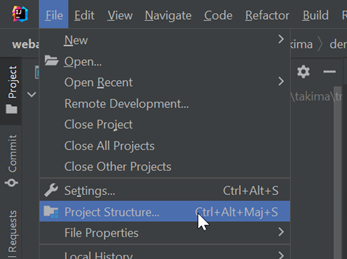
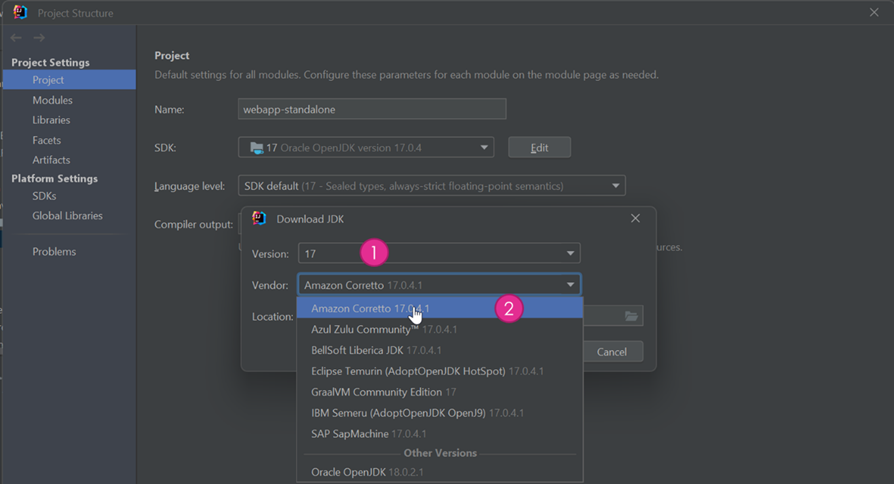
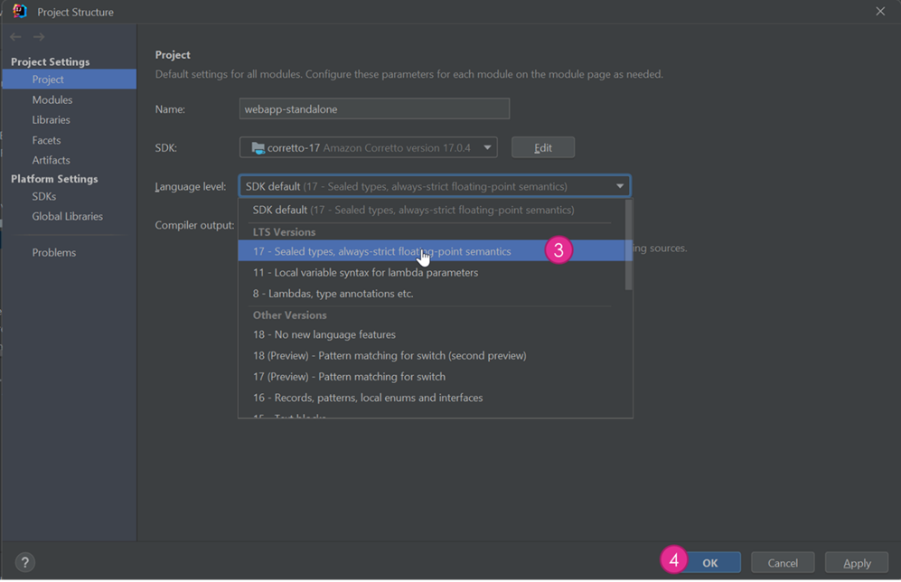

Sélectionne Git Bash    
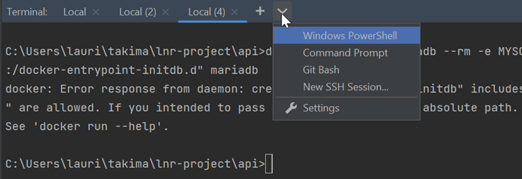

Copie-colle le .env.sample en .env
Fait un docker-compose up

Rajoute le pluggin : https://plugins.jetbrains.com/plugin/7861-envfile   

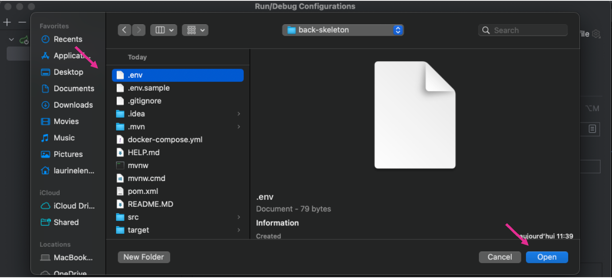

### II. Set up

2. Afficher la BDD dans Intellij
Effectue les étapes suivantes :   
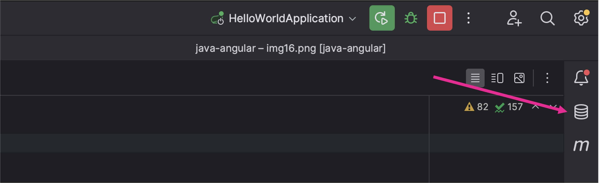
 

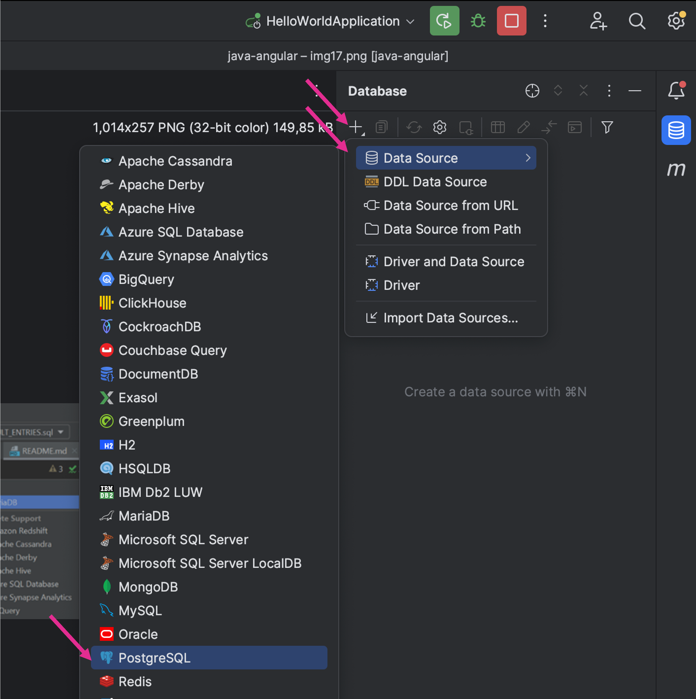

Installe les drivers si besoin :  
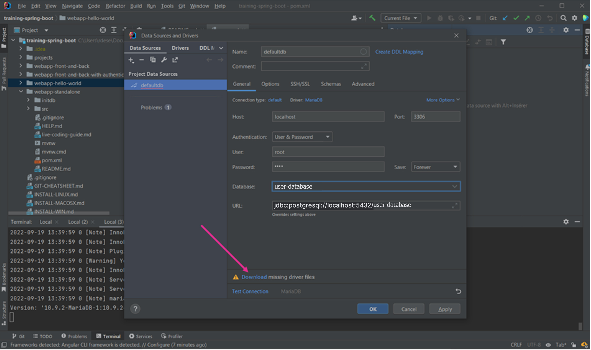

Saisie les infos (1-3), puis test la connexion à la bdd (4)   
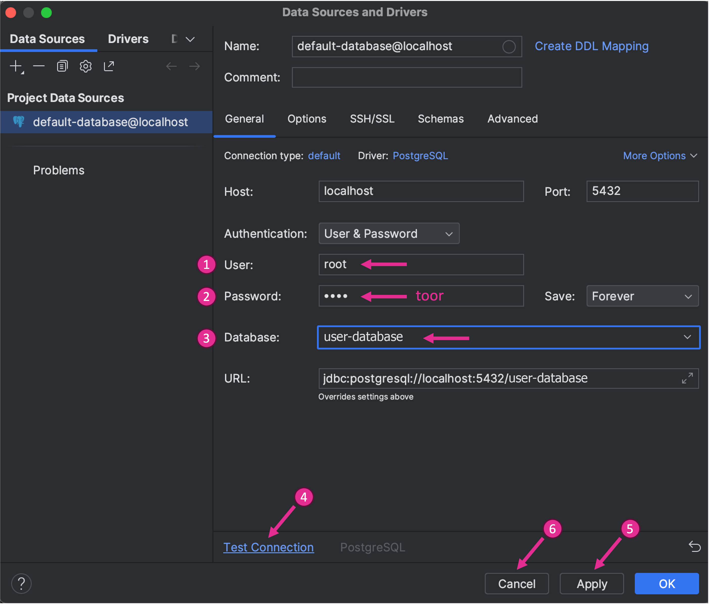
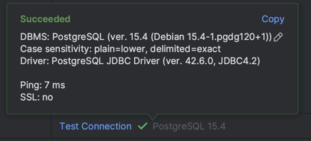

 
Si c'est valide, clique sur OK (5)

3. Initialisation de la BDD
C'est cool d'avoir une BDD qui fonctionne mais c'est encore plus cool quand on peut lui insérer des données en 2 clics :
  
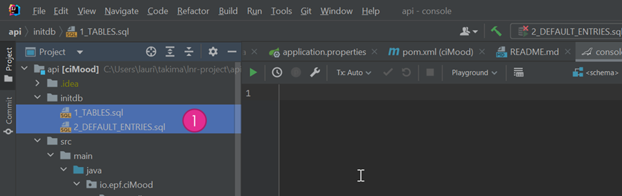

Clic droit + run : 
  
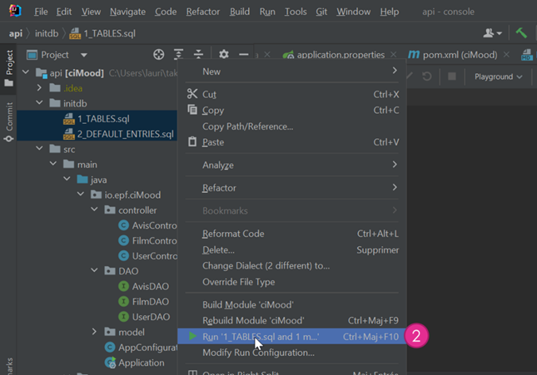
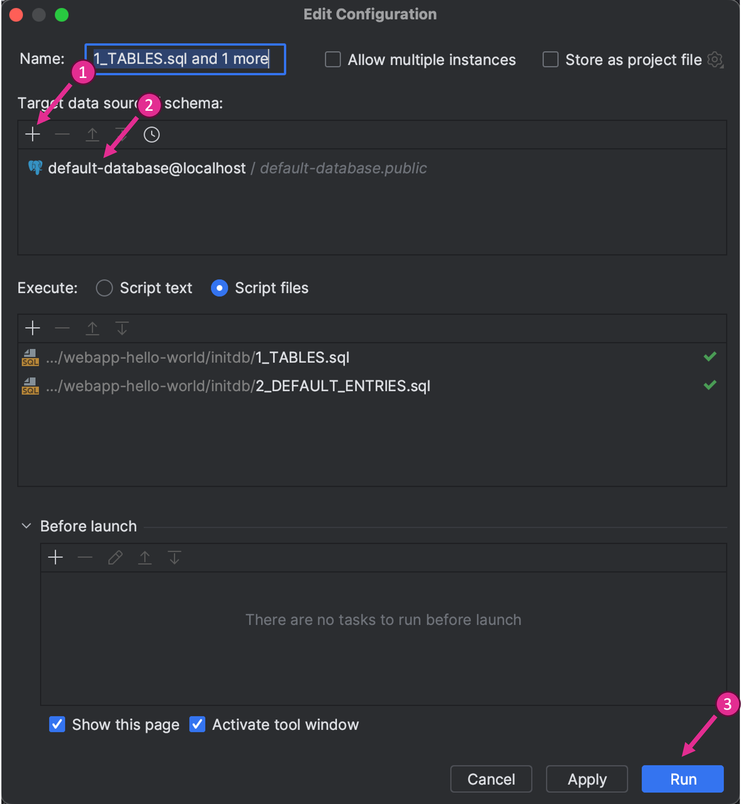

Tadaaaam (j'avoue un peu plus que 2 clics)   
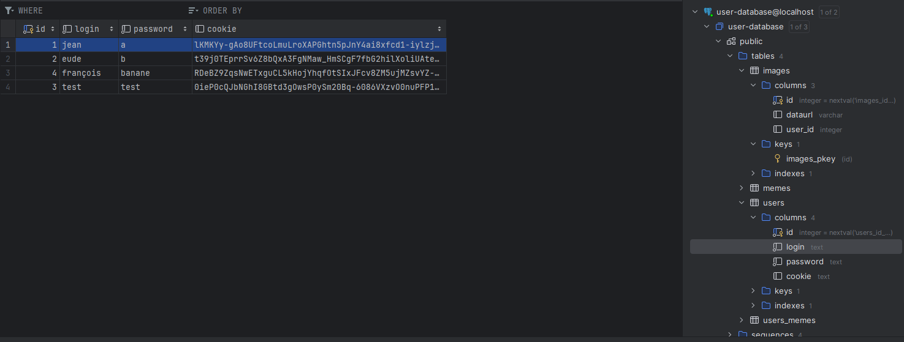
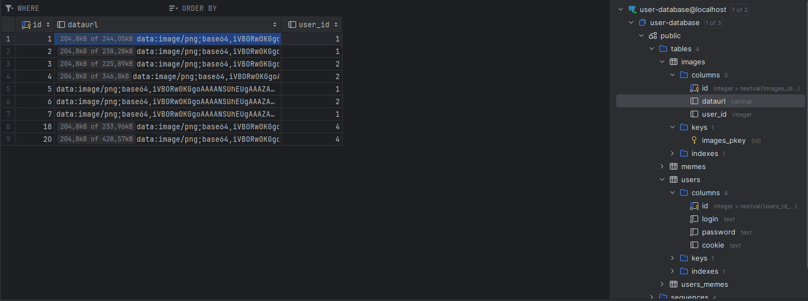

### IV. Run du projet 
Run BackSkeletonApplication

## Setup Frontend
npm install -g @angular/cli  
npm install ts-evaluator  
npm install @angular/router --force  
ng update @angular/cli@latest @angular/core@latest  
npm install bootstrap  
ng serve  

### Fonctionalités :
Fonctionalité 1: Système de compte avec une inscription(mot de passe et username doivent faire plus de 3 caractères) et une connexion avec un cookie (qui s'update dans la bdd connexion/déconnexion) redirigeant vers la page de connexion si non-valide, bouton de déconnexion.
Fonctionalité 2 : Importation d'une image sur le site, bouton : "choisir un fichier" (image 400x400 et sont stockées en base 64)
Fonctionalité 3 : Téléchargement d'une image depuis le site sur l'ordinateur, bouton : Télécharger
Fonctionalité 7 : Sauvegarder l'image dans la base de données, bouton : Sauvegarder
Fonctionalité 4 : Ajout de textes de couleurs différentes sur l'image, bouton : ajouter du texte (sélectionner la couleur avant d'apputer sur le bouton)
Fonctionalité 6 : Onglet historique de tout les memes sauvegardés sur le site (téléchargemet possible), bouton : Voir les memes de la communauté
Fonctionalité 7 : Onglet historique des memes sauvegardés par l'utilisateur actuel (téléchargement + suppression possible), bouton : Voir tous mes memes

## Data Structure 
 

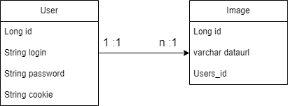

